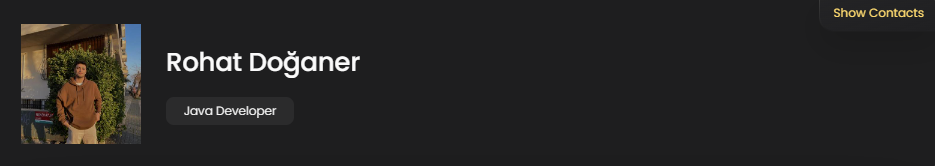

# Rohat Doğaner Portfolio

Welcome to my portfolio website! You can explore my work, projects, and get in touch with me.

## Website

[Visit My Portfolio](https://rohatdoganer.dev/)

## Features

- **Home Page**: An overview of who I am and what I do.
- **Projects**: A showcase of my projects with descriptions and links.
- **Contact**: Ways to get in touch with me.

## Technologies Used

- **Frontend**: HTML, CSS, JavaScript

## How to Use

1. **Visit the Website**: Click the link above to visit my portfolio.
2. **Navigate Through Sections**: Use the navigation bar to explore different sections of the website.
3. **View Projects**: Check out the projects section to see detailed descriptions and links to my work.
4. **Contact Me**: Use the contact form to get in touch with me for any inquiries or collaborations.

## Contributing

Feel free to open an issue or submit a pull request if you have any suggestions for improvements.

## License

This project is licensed under the MIT License. See the [LICENSE](LICENSE) file for details.

## Acknowledgements

- Thanks to all the open-source projects and libraries used in building this portfolio.

